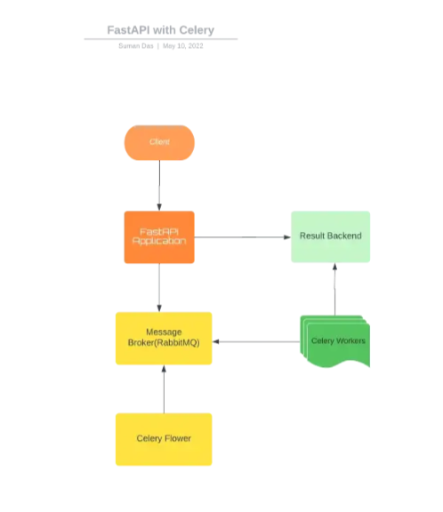

## Implementacion de fastapi con celery y rabbitmq



### Levantar RabbitMQ con docker
```shell
docker-compose up -d
```

### Instalar dependencias con pipenv
```shell
pipenv install -r requirements.txt
```

### Levantar celery
```shell
celery -A main.celery worker --loglevel=info -Q universities,university
```

### Levantar celery monitor(flower)
```shell
celery -A main.celery flower --port=5555
```

### Probar endpoints con swagger
[Swagger](http://localhost:9000/docs)

### Ver tareas con flower
[Flower](http://localhost:5555/)

### Articulo
[Medium](https://medium.com/cuddle-ai/async-architecture-with-fastapi-celery-and-rabbitmq-c7d029030377)